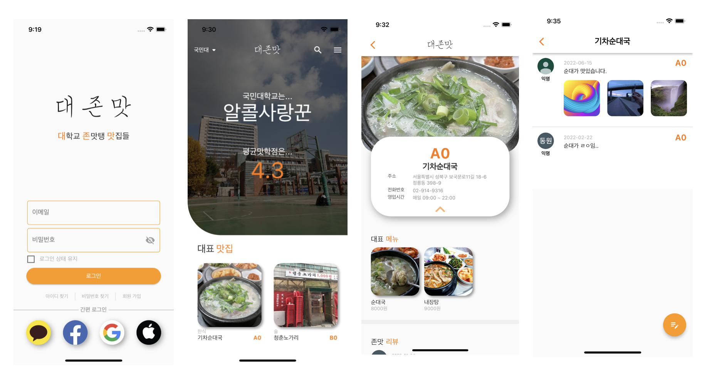

## DJM project
대존맛 프로젝트는 비대면 상황에서 학교의 주요 맛집 정보를 빠르게 얻고 커뮤니케이션하기 위한 어플리케이션입니다.

### 주요 기능
1. 메인 - 그리드뷰를 통해 주요 맛집들을 맛학점순으로 볼 수 있습니다.
2. 상세 정보 - 맛집의 상세정보를 확인할 수 있습니다.
3. 리뷰 - 유저는 리뷰를 통해 맛집의 실시간 정보를 확인할 수 있으며 직접 리뷰를 올릴 수 있습니다.

### 부가 기능
- 로컬 회원가입 및 로그인 가능
- 구글 로그인 가능 

모든 서버 및 데이터베이스는 파이어베이스를 사용하였습니다.

